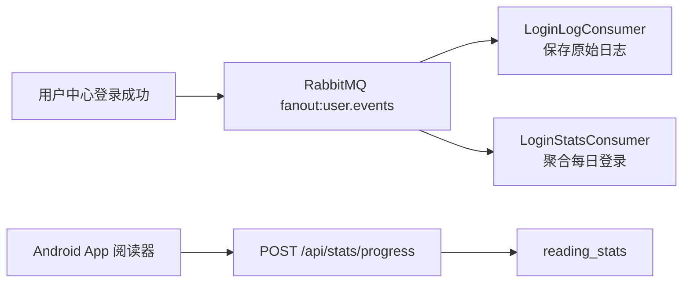

# BookRealm Event Stats

**事件统计服务:消费登录事件,接收阅读进度,提供统计查询 API**

这是一个可独立运行的 Spring Boot + RabbitMQ 示例服务。它把“记录行为”从登录和阅读主链路里拆出来,让主功能保持轻,统计能力异步增长。

[BookRealm 平台书](https://wohuishuo.github.io/book-realm/) · [本服务实战章](https://wohuishuo.github.io/book-realm/project/event-stats)

## 一分钟理解

**br-event-stats 负责回答“用户什么时候登录、读到哪里”。**

用户中心登录成功后发布 `UserLogin` 事件;本服务通过 RabbitMQ 消费事件,保存登录日志并聚合每日登录数。Android App 阅读时通过 HTTP 上报进度;本服务按用户、书、日期更新阅读统计。



## 已实现功能

| 能力 | 说明 |
| --- | --- |
| 登录日志 | 消费 `UserLogin` 事件,保存每次登录记录 |
| 登录聚合 | 按日期与登录端类型统计 App/Web/Desktop 登录数 |
| 阅读进度 | 接收 App 上报的 `userId/bookId/chapterId/paragraphIndex` |
| 查询 API | 提供登录统计与阅读统计查询接口 |

## 快速开始

```powershell
# 1. 启动依赖
rabbitmq-server -detached
mysql -u root -e "CREATE DATABASE IF NOT EXISTS book_realm_stats DEFAULT CHARACTER SET utf8mb4;"

# 2. 启动服务
mvn spring-boot:run

# 3. 健康检查
curl http://localhost:8083/api/health
```

Swagger:<http://localhost:8083/api/swagger-ui.html>

## API

| 方法 | 路径 | 说明 |
| --- | --- | --- |
| GET | `/api/health` | 健康检查 |
| GET | `/api/stats/logins?from=&to=` | 查询登录统计 |
| POST | `/api/stats/progress` | App 上报阅读进度 |
| GET | `/api/stats/reading?from=&to=` | 查询阅读统计 |

阅读进度请求:

```json
{
  "userId": 2,
  "bookId": 1,
  "chapterId": 1,
  "paragraphIndex": 7
}
```

## 在 BookRealm 中的位置

| 上游/下游 | 关系 |
| --- | --- |
| [user-center-team-project](https://github.com/wohuishuo/user-center-team-project) | 发布 `UserLogin` 事件 |
| [br-reader-app](https://github.com/wohuishuo/br-reader-app) | HTTP 上报阅读进度 |
| [book-realm](https://github.com/wohuishuo/book-realm) | 平台总书和完整教学 |

## 文档

| 文档 | 内容 |
| --- | --- |
| [`docs/design.md`](docs/design.md) | 事件驱动设计、表结构、接口边界 |
| [`docs/notes.md`](docs/notes.md) | 真实踩坑与联调记录 |
| [平台书实战章](https://wohuishuo.github.io/book-realm/project/event-stats) | 站在完整平台视角讲解本服务 |

## 测试

```powershell
mvn test
```
